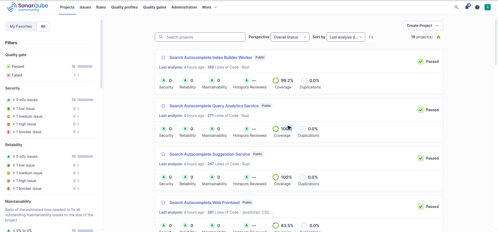

# Local SonarQube

This Compose setup runs SonarQube Community Build with PostgreSQL 18.

A complete document map is available in the [Documentation index](docs/README.md).

## Contents

- [Start](#start)
- [Connect Codex to SonarQube MCP](#connect-codex-to-sonarqube-mcp)
- [Persistent volumes](#persistent-volumes)
- [Stop](#stop)
- [Build and use prerequisites](#build-and-use-prerequisites)
- [Deploy and undeploy](#deploy-and-undeploy)
- [Screenshots](#screenshots)
- [AI development disclaimer](#ai-development-disclaimer)

## Start

On Linux, set the host requirement before starting SonarQube:

```sh
sudo sysctl -w vm.max_map_count=524288
```

Start the services from this directory:

```sh
docker compose up -d
```

Open [http://localhost:9000](http://localhost:9000). The initial SonarQube login is `admin` / `admin`.

PostgreSQL uses the user `sonar`, database `sonarqube`, and default password `sonar`.

## Connect Codex to SonarQube MCP

Start the Compose stack first. In `~/.codex/config.toml`, add this MCP server configuration, replacing the token placeholder with a SonarQube **user token**:

```toml
[mcp_servers.sonarqube]
command = "docker"
args = ["run", "--rm", "-i", "--init", "--pull=always", "--add-host=host.docker.internal:host-gateway", "-e", "SONARQUBE_TOKEN", "-e", "SONARQUBE_URL", "sonarsource/sonarqube-mcp"]
env = { "SONARQUBE_TOKEN" = "<YOUR_SONARQUBE_USER_TOKEN>", "SONARQUBE_URL" = "http://host.docker.internal:9000" }
```

The MCP runs in its own Docker container, so it uses `host.docker.internal` to reach SonarQube's published port on the host. Keep the token in your local Codex config; do not add a real token to this repository. If `sonarqube` is already configured, update that entry instead of adding a duplicate.

Check the configuration with `codex mcp list`, then restart Codex to load it. Ask Codex to call the MCP `ping_system` tool to confirm the connection. See the [SonarQube Codex setup guide](https://docs.sonarsource.com/sonarqube-mcp-server/setup/quickstart-guides/codex-cli) and [self-hosted setup](https://docs.sonarsource.com/sonarqube-mcp-server/setup/self-hosted).

## Persistent volumes

The Compose file declares these named volumes:

- `postgres_data` stores the PostgreSQL database.
- `sonarqube_data` stores SonarQube data.
- `sonarqube_extensions` stores installed plugins and extensions.
- `sonarqube_logs` stores SonarQube logs.

Docker Compose creates the volumes automatically the first time you start the stack with `docker compose up -d`; no separate volume-creation command is needed. Compose prefixes the volume names with the project name (usually the directory name). List them with:

```sh
docker volume ls
```

## Stop

Stop and remove the containers while keeping the named volumes and their data:

```sh
docker compose down
```

Start them again with `docker compose up -d`.

## Build and use prerequisites

- **Build/start:** Docker Engine with the Compose plugin. Linux hosts must set `vm.max_map_count` to at least `524288` as shown above. Compose pulls the published SonarQube and PostgreSQL images; this repository does not build custom images.
- **Use:** a browser, available host port `9000`, and a running Compose stack. Keep locally generated user tokens in local configuration only.

## Deploy and undeploy

`docker compose up -d` pulls missing images and starts both services. Open `http://localhost:9000` to use SonarQube and its project dashboards. The Compose stack is the deployment target; there is no separate build or Kubernetes deployment in this repository.

Use `docker compose down` to remove containers while keeping the named database and SonarQube volumes. Use `docker compose down -v` only when intentionally deleting all local projects, analysis history, and PostgreSQL data.

## Screenshots




## AI development disclaimer

> **AI development disclaimer:** This project was built entirely with GPT-6 Luna at Max effort as a proof of concept exploring how low-cost AI plans can be useful when paired with disciplined harness and loop engineering. This is project-owner attribution; repository contents do not independently verify runtime model metadata. Review AI-generated design and code before relying on them.
