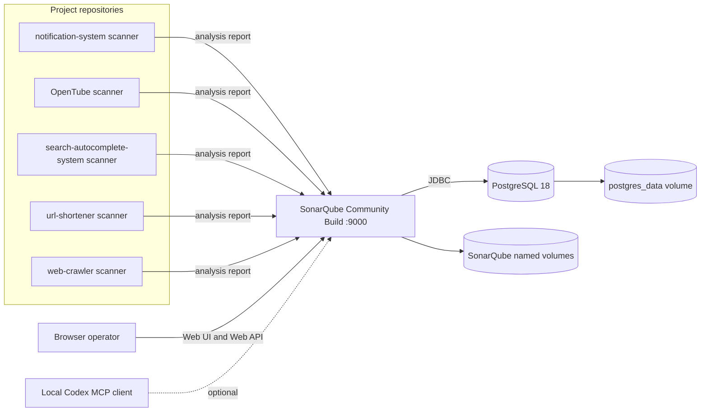
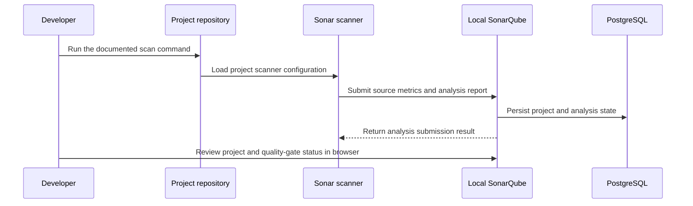

# Local SonarQube System Design

This document describes the implemented local SonarQube Community Build stack and the repositories that submit analyses to it.

> Project documentation index: [Documentation index](README.md) · Database boundary: [Database model](database-model.md) · Interfaces: [Contract catalog](contracts/README.md)

> Project decision records: [ADR index](adr/README.md).

## Contents

- [Abstract](#abstract)
- [Goals and non-goals](#goals-and-non-goals)
- [Background and constraints](#background-and-constraints)
- [Proposed architecture and ownership](#proposed-architecture-and-ownership)
- [Analysis lifecycle](#analysis-lifecycle)
- [API and data contracts](#api-and-data-contracts)
- [Consistency and persistence](#consistency-and-persistence)
- [Security and privacy](#security-and-privacy)
- [Operational readiness](#operational-readiness)
- [Alternatives and trade-offs](#alternatives-and-trade-offs)
- [Open questions](#open-questions)
- [Decision and next steps](#decision-and-next-steps)
- [References](#references)

## Abstract

This repository runs a local SonarQube Community Build server and PostgreSQL 18 with Docker Compose. Five project repositories configure scanner clients that submit analysis reports to the server. The stack is a single-user development and verification environment; it is not configured as a production service or a Kubernetes deployment.

## Goals and non-goals

**Goals**

- Provide a persistent local SonarQube endpoint for the associated project repositories.
- Keep scanner configuration in each consumer repository and the SonarQube server/database lifecycle in this repository.
- Preserve analysis history and server data when containers are stopped or recreated.

**Non-goals**

- Production hosting, high availability, backups, remote access, or multi-user operations.
- Owning SonarSource's Web API, scanner protocol, plugin behavior, or private database schema.
- Building custom SonarQube or PostgreSQL images, or deploying workloads to Kubernetes.

## Background and constraints

The local stack uses the published `sonarqube:community` and `postgres:18` images. The server starts after PostgreSQL passes its health check. Linux hosts must set `vm.max_map_count` to at least `524288`. The Compose file publishes port `9000` on all host interfaces and uses a local fallback database password; operators should treat the setup as a workstation-only service.

## Proposed architecture and ownership

The repository owns the Compose topology and local volume configuration. SonarSource owns the server, scanner submission, and Web API contracts. Each analyzed project owns its scanner settings and source code. PostgreSQL stores the server-managed project and analysis state; its internal tables are not an integration contract.

The Codex MCP client is optional local configuration outside this repository. It runs in a separate container and reaches the host-published endpoint using `host.docker.internal`.

## Analysis lifecycle

## API and data contracts

SonarSource owns the SonarQube Web API and scanner submission protocol. The local service implements that contract; scanner clients consume it. The [contract catalog](contracts/README.md) links the known consumers and their scanner paths:

| Consumer repository | Component or configuration | Local source path |
| --- | --- | --- |
| `notification-system` | Sonar scanner configuration | [`.sonar/`](https://github.com/marcelomiyake/notification-system/tree/main/.sonar) |
| `opentube` | Sonar scan script | [`scripts/sonar-scan-all.sh`](https://github.com/marcelomiyake/opentube/blob/main/scripts/sonar-scan-all.sh) |
| `search-autocomplete-system` | Sonar scan script | [`scripts/sonar-scan.sh`](https://github.com/marcelomiyake/search-autocomplete-system/blob/main/scripts/sonar-scan.sh) |
| `url-shortener` | Sonar scan script | [`scripts/sonar-scan.sh`](https://github.com/marcelomiyake/url-shortener/blob/main/scripts/sonar-scan.sh) |
| `web-crawler` | Sonar scanner configuration | [`.sonar/`](https://github.com/marcelomiyake/web-crawler/tree/main/.sonar) |

The local MCP connection is optional. Its user token belongs in the operator's private Codex configuration, not in a repository file.

## Consistency and persistence

Analysis submissions are processed and persisted by SonarQube. The server uses PostgreSQL as its database and named Docker volumes for server data, extensions, and logs. Stopping the Compose project keeps those volumes. Removing them deletes local project configuration and analysis history. Do not read or write SonarQube's private tables directly.

## Security and privacy

The Compose file uses a local development database password by default and publishes SonarQube on host port `9000`. Change the password through `SONAR_DB_PASSWORD` and keep tokens in private local configuration. Do not expose this stack to untrusted networks or upload sensitive source without an explicit review of SonarQube access controls and data handling.

## Operational readiness

- **Build/start prerequisites:** Docker Engine with the Compose plugin; Linux hosts also need `vm.max_map_count=524288`. This repository pulls published images and does not build application images.
- **Use prerequisites:** a browser, available host port `9000`, and a running Compose stack. Scanner consumers require their own documented scanner tools and project settings.
- **Deploy/use:** from the repository root, run `docker compose up -d`, then open `http://localhost:9000`. See the [project README](../README.md) for Codex MCP configuration.
- **Undeploy with persistence:** run `docker compose down`; named volumes remain. Run `docker compose down -v` only to intentionally remove the database, project state, history, extensions, and logs.
- **Kubernetes resources:** not applicable; this repository defines Docker Compose services and no Kubernetes pods.

## Alternatives and trade-offs

Compose keeps the local server and database lifecycle reproducible and preserves data across container replacement. A remote managed SonarQube server would reduce workstation resource use but would require an independently operated endpoint and credentials. The repository currently selects local Compose for its proof-of-concept workflow and does not define that remote setup.

### Architecture practice fit

Clean Architecture, DDD, and CQRS do not provide a useful code structure for this repository: it defines Compose configuration and local operations, while SonarQube owns the application behavior and database schema. Keep the repository declarative, with one documented source for Compose settings and links to the authoritative scanner/API contracts. Apply YAGNI and KISS by avoiding wrappers or extra services around a single local stack; apply DRY only where repeated settings share the same owner. Revisit this boundary only if the repository begins to own executable application code.

## Open questions

- Before sharing the service beyond a trusted workstation, should the port bind only to loopback and should authentication/default credentials be hardened?
- What backup and retention procedure should be used if local analysis history becomes important?
- What resource caps should be set if workstation contention becomes an issue? Compose currently declares no CPU or memory limits.

## Decision and next steps

Keep the current local Compose stack and named volumes for the single-user workflow. Treat network exposure, production use, backups, retention, and resource limits as unresolved operational requirements rather than implied capabilities.

## References

- [Compose configuration](../compose.yaml)
- [Project README](../README.md)
- [Contract catalog](contracts/README.md)
- [Database model boundary](database-model.md)
- [Codex Hooks reference](https://learn.chatgpt.com/docs/hooks)
